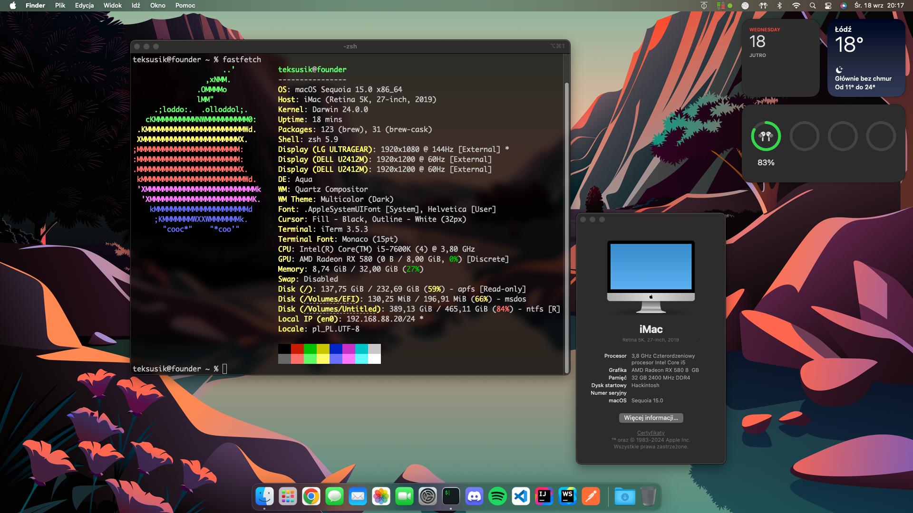

## Specification
| **Component** | **Model** |
| ------------- | --------- |
| CPU | Intel Core i5-7600K @ 3.8GHz to 4.6GHz |
| Motherboard | Gigabyte Z270-HD3P |
| RAM | 32GB (4 x 8GB) Patriot Signature @ 2400MHz |
| GPU | Gigabyte Aourus RX580 8GB |
| OS Disk | Samsung 970 EVO 250GB |
| Ethernet | Intel I219-V |
| WiFi & Bluetooth | Fenvi T919 |

**macOS version:** macOS Sonoma 14.4.1 (23E224)  
**OpenCore version:** 0.9.9 + OCLP   
**SMBIOS**: iMac 19,1  

## Software compatibility
 - Sonoma (14.x)
 - Ventura (13.x)
 - Monterey (12.x)
 - Big Sur (11.x)
 - Earlier versions alo should work but are not tested

## Hardware compatibility
### CPU
The EFI is compatible with Intel Core Desktop Kaby Lake (7XXX) processors.

### GPU
Nvidia GPUs support is complicated and will not be discussed in this repository. 
| **Component** | **Supported?** |
| ------------- | --------- |
| Integrated | Requires changes1 |
| AMD | Yes2 |
| NVIDIA | Requires changes3 |

1Modifications to SMBIOS and DeviceProperties will be required. Propably some framebuffer patches also should be applied.  
2Some of R7 and R9 GPUs requires spoofing. More info [here](https://dortania.github.io/Getting-Started-With-ACPI/Universal/spoof.html).  
3NVIDIA's GPU support is complicated. You can find more info [here](https://dortania.github.io/OpenCore-Install-Guide/macos-limits.html#gpu-support) and [here](https://dortania.github.io/GPU-Buyers-Guide/modern-gpus/nvidia-gpu.html#pascal-series-gtx-10xx).

### Motherboard
All motherboards should be supported out of the box.

### Storage
For the most part, all SATA based drives are supported and the majority of NVMe drives as well. Updating storage firmware should fix any problems. Using Intel Optane Memory or micron 3D XPoint are unsupported in macOS.

### Networking
#### Wired
Intel NICs (82578, 82579, I217, I218 and I219) are supported. To use other NICs you must use a different kexts.
#### Wireless
Fenvi T919 wireless card works on Somona after applying OCLP root patches and supports features like AirDrop, Continuity, etc. Before Sonoma, it works out of the box.

## Security
This build has security features such as Secure Boot, System Integrity Protection, and Apple Mobile File Integrity disabled due to the application of OpenCore Legacy Patcher patches. FileVault is also unavailable.  

## Installation
 1. Use [this](https://dortania.github.io/OpenCore-Install-Guide/installer-guide/) guide to create USB with macOS recovery.
 2. Clone this repository and copy "BOOT" and "OC" directories to "EFI" directory on your USB.
 3. Modify "MLB", "ROM", "SystemSerialNumber" and "SystemUUID" in EFI/OC/config.plist using [GenSMBIOS](https://github.com/corpnewt/GenSMBIOS) script with iMac19,1 SMBIOS. You can find more detailed instructions [here](https://dortania.github.io/OpenCore-Install-Guide/config.plist/kaby-lake.html#platforminfo).
 4. Follow [Dortania](https://dortania.github.io/OpenCore-Post-Install/) post-install guide.

## Credits
 - [[Bootloader] OpenCore](https://github.com/acidanthera/OpenCorePkg)
 - [[SSDT] SSDT-EC-USBX-DESKTOP](https://github.com/dortania/Getting-Started-With-ACPI/blob/master/extra-files/compiled/SSDT-EC-USBX-DESKTOP.aml)
 - [[SSDT] SSDT-PLUG-DRTNIA](https://github.com/dortania/Getting-Started-With-ACPI/blob/master/extra-files/compiled/SSDT-PLUG-DRTNIA.aml)
 - [[Driver] HFSPlus](https://github.com/acidanthera/OcBinaryData/blob/master/Drivers/HfsPlus.efi)
 - [[Driver] OpenRuntime](https://github.com/acidanthera/OpenCorePkg)
 - [[Driver] OpenCanopy](https://github.com/acidanthera/OpenCorePkg)
 - [[Kext] Lilu](https://github.com/acidanthera/Lilu)
 - [[Kext] VirtualSMC](https://github.com/acidanthera/VirtualSMC)
 - [[Kext] WhateverGreen](https://github.com/acidanthera/WhateverGreen)
 - [[Kext] AppleALC](https://github.com/acidanthera/AppleALC)
 - [[Kext] IntelMausi](https://github.com/acidanthera/IntelMausi)
 - [[Kext] RadeonSensor](https://github.com/NootInc/RadeonSensor)
 - [[Kext] SMCRadeonGPU](https://github.com/NootInc/RadeonSensor)
 - [[Kext] USBToolBox](https://github.com/USBToolBox/kext)
 - [[Kext] FeatureUnlock](https://github.com/acidanthera/FeatureUnlock)
 - [[Kext] IOSkywalk](https://github.com/dortania/OpenCore-Legacy-Patcher/tree/main/payloads/Kexts/Wifi)
 - [[Kext] IO80211FamilyLegacy](https://github.com/dortania/OpenCore-Legacy-Patcher/tree/main/payloads/Kexts/Wifi)
 - [[Tool] ProperTree](https://github.com/corpnewt/ProperTree)
 - [[Tool] GenSMBIOS](https://github.com/corpnewt/GenSMBIOS) 
 - [[Tool] MountEFI](https://github.com/corpnewt/MountEFI) 
 - [[Tool] ocvalidate](https://github.com/acidanthera/OpenCorePkg) 
 - [[Tool] OCConfigCompare](https://github.com/corpnewt/OCConfigCompare) 
 - [Dortania](https://dortania.github.io/) for config guides
